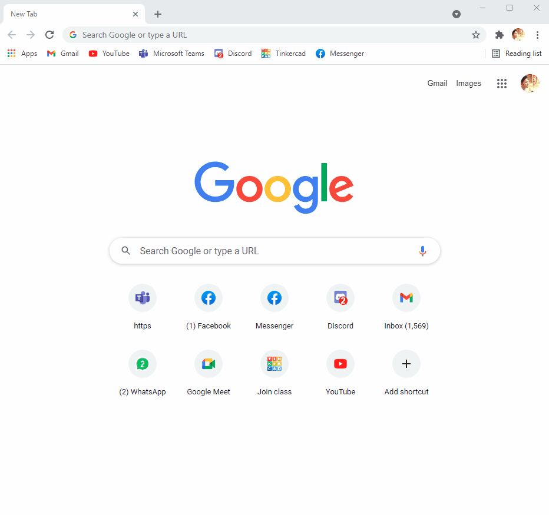

# Hide Shared Post


Scrolling through Facebook newsfeed is tough when someone keeps sharing posts like crazy. And stalking my crush was a pain too -_- . She keeps sharing stuffs like crazy. Anyhow that's when I got this idea to create a browser extension for chrome to hide those irritating posts. As for now I am not gonna add it to chrome store. Too much pain


## Features

- Hide shared posts of specific users
- Hide shared posts of everyone

## Features for future

- Hide facebook adds
- Create a custom popup menu with all the features

## How to add extension

- Download this repository as zip then unzip or clone to local.
- Then go to chrome [extension](chrome://extensions/) . => That three dot in top right => More tools =>Extensions
- Enable developer mode
- Click load unpacked button
- And then select the downloaded folder





## How to add users to list

Go to content.js file and you will see an array at first. Change the names there with the user name you want. 

```javascript
var names = ["Kazi Ababil Azam Talha","Kowsar Mahmud Pappu"];
```

And to block everyone change hideAll to true

```javascript
var hideAll = false;
```


## Problems

As Facebook is a react app, it acts a bit different than other webpages. When you change pages from feed to someone's timeline you need to reload from task bar manually.

And it might be the case that the class id of facebook might change. Then the whole HTML Query Selection process wont work. But can be edited easily with some simple changes. But I hope they won't change


## Conclusion

If you love my work you can follow me or star this repo. Thank you